<h1 align="center">Hey  I'm Neeraj Gupta</h1>
<h3 align="center">AI&ML Engineer • Building Intelligent Systems • Full-Stack Developer</h3>

  

## 📌 About Me
- 🚀 Building agentic AI systems & automation workflows
- 🧠 Exploring LLMs, multi-agent systems & real-world applications
- ⚙️ Working on scalable backend + intelligent architectures
- 🤝 Open to collaborations on AI, system design & impactful products
- 🔥 Obsessed with turning ideas into execution systems

## 🧠 My Focus Areas
- Agentic AI & Autonomous Systems
- Machine Learning & Deep Learning
- Full Stack System Design (MERN)
- Generative AI & LLM Applications
- Scalable Backend & APIs

## 📊 GitHub Stats & Trophies

  
  

  

  

## 🛠️ Languages & Tools

<a href="https://tenor.com/view/programmer-rounded-edges-gif-26214286">Programmer Rounded Edges GIF</a>from <a href="https://tenor.com/search/programmer-gifs">Programmer GIFs</a>
 

<h3 align="center">Programming Languages</h3>

  &nbsp;&nbsp;
  &nbsp;&nbsp;
  &nbsp;&nbsp;
  &nbsp;&nbsp;
  

<h3 align="center">Frontend</h3>

  &nbsp;&nbsp;
  &nbsp;&nbsp;
  &nbsp;&nbsp;
  

<h3 align="center">Backend</h3>

  &nbsp;&nbsp;
  &nbsp;&nbsp;
  

<h3 align="center">Database</h3>

  &nbsp;&nbsp;
  &nbsp;&nbsp;
  

<h3 align="center">DevOps & Cloud</h3>

  &nbsp;&nbsp;
  &nbsp;&nbsp;
  &nbsp;&nbsp;
  &nbsp;&nbsp;
  

<h3 align="center">Tools</h3>

  

  

 

## 🔗 Connect with Me

  &nbsp;&nbsp;
  

## 💬 Quote
> Complex problems don’t need more effort—they need better systems.

  

  

